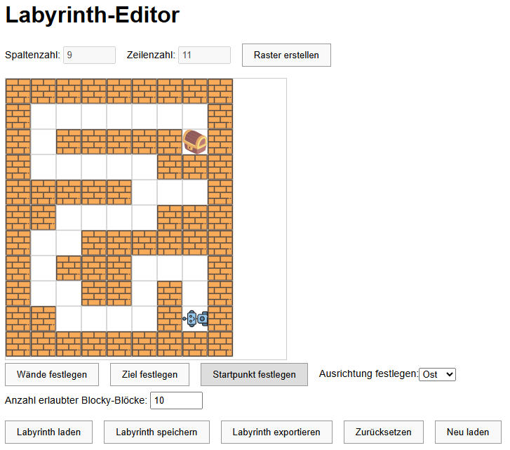

# 🧱 Blockly-Labyrinth-Editor

Der Editor für Laby. Hier kannst Du eigene Labyrinthe für [Laby](https://github.com/ToniTaste/Laby) entwickeln. 

## 🔍 Funktionen

- Grafischer Editor zum Bau des Labyrinths bestehend aus Wänden, einem Roboter und einer Schatzkiste
- Festlegung der Anzahl der erlaubten Programmierschritte
- Speichern/Laden des Labyrinths für den Editor
- Export des Labyrinths für Laby 

## 🖼️ Screenshot



## 🚀 Online ausprobieren

> Wird unterstützt durch **GitHub Pages**.

👉 [Hier klicken, um das Projekt direkt im Browser zu starten](https://tonitaste.github.io/Laby-Editor/)

## 📦 Installation (lokal)

Du kannst das Projekt lokal starten, indem du die Dateien einfach in einen Ordner speicherst und `index.html` in einem Browser öffnest:

```bash
git clone https://github.com/ToniTaste/Laby-Editor.git
cd Laby-Editor
# Dann: index.html im Browser öffnen
